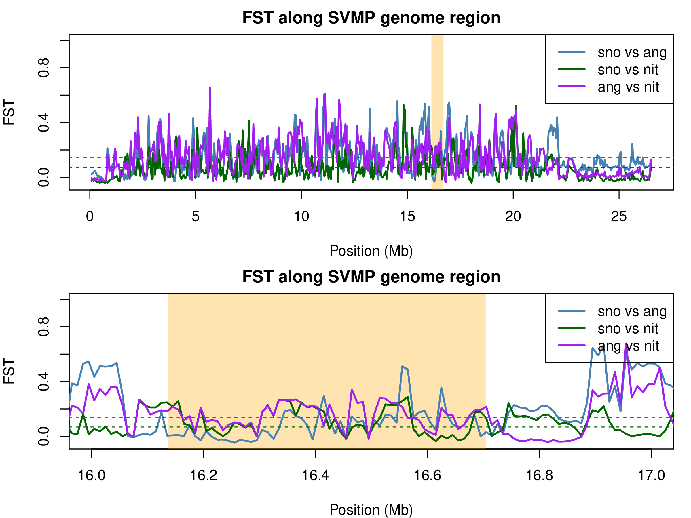

# Workflow of the role of BLS in venom coding regions of the common adder
All steps done to generate final thesis should be documented in detail here.The goal is to find evidence for both long term and recent balancing selection and if inbreeding has a negative effect on populations capability to maintain their venom geno-/phenotype diversity through balancing selection


## Step 1: Annotating the venom coding regions
First step of the project is to locate (annotate) the venom coding regions of vipera berus. To be able to test for types of selection, we need to decide at what genome regions we want to look. 
To achieve this, literature was compared. As we do not have a venom gland transcriptome, we cannot use such cds to find our venom genes in the genome. we do have a high quality sanger sequence reference genome and found the ToxCodAn Pipeline to annotate venom genes without using a custom cds derived from a transcriptome, using a generally available viperidae toxing database, compiled by the same authors.
the example presented is on the 2nd haplotype of the vipera berus reference individual.

The following script had the following prerequesits to be installed in this case on my local machine:
- python, biopython and pandas
- NCBI-BLAST (v2.9.0 or above)
- Exonerate
- Miniprot
- GffRead
- R

Viperidae Database used:
```{bash}
wget https://raw.githubusercontent.com/pedronachtigall/ToxCodAn-Genome/main/Databases/Viperidae_db.fasta
```
Reference Genome used:
```{bash}
wget https://ftp.ncbi.nlm.nih.gov/genomes/all/GCA/964/194/415/GCA_964194415.1_rVipBer3.hap1.1/GCA_964194415.1_rVipBer3.hap1.1_genomic.fna.gz 
```


run ToxCodAn, i made a conda environment on my local machine, which i would activate before being able to run toxcodan:
```{bash}
 /home/alexn/Annotating/ToxCodAn-Genome/bin/toxcodan-genome.py -g /home/alexn/Annotating/ber_hap2.fna -d /home/alexn/Annotating/Viperidae_db.fasta -c 6
```


to make tsv file for visualisation from gtf:
```{bash}
python ToxCodAn-Genome/bin/fromCDStoGENE.py   ToxCodAnGenome_output_ber_hap2/toxin_annotation.gtf   ToxC
odAnGenome_output_ber_hap2/toxin_annotation_GENE_ber_hap2.tsv
```

use r in bash to make nice little plot:
```{bash}
Rscript ToxCodAn-Genome/bin/PlotToxinLoci.R   -i ToxCodAnGenome_output_ber_hap2/toxin_annotation_GENE_ber_hap2.tsv   -o output
```

Next step is to check these annotations, both manually and blasting them against other resources.


## Step 2: First look at situation for those genes: Fst for chromosome 8, 9 and 17 + zoomed in on venom regions

bamlists used:
```{bash}
#bamlists of 10 individuals of a valley population in snowdonia (sno) and 10 from a population in angelesy (ang) and 10 from nidderdale

#pop1(sno)
/scratch/scw2119/BEARCAVE2/mappedrVipBer3/zob+ww5350_ber_rVipBer3_22.05937.bam   #ww5350
/scratch/scw2119/BEARCAVE2/mappedrVipBer3/4tn+CB2402_ber_rVipBer3_19.07273.bam  #CB2402
/scratch/scw2119/BEARCAVE2/mappedrVipBer3/354_t7b+CB2401_ber_rVipBer3_13.60444.bam  #CB2401
/scratch/scw2119/BEARCAVE2/mappedrVipBer3/wgd+SVb392_ber_rVipBer3_9.47505.bam
/scratch/scw2119/BEARCAVE2/mappedrVipBer3/6c8+LD2401_ber_rVipBer3_12.02264.bam  #LD2401
/scratch/scw2119/BEARCAVE2/mappedrVipBer3/kdg+LD2402_ber_rVipBer3_13.33262.bam  #LD2402
/scratch/scw2119/BEARCAVE2/mappedrVipBer3/4bv_fpt+ww5274_ber_rVipBer3_12.21256.bam  #ww5274
/scratch/scw2119/BEARCAVE2/mappedrVipBer3/u2p+ww5275_ber_rVipBer3_11.93115.bam  #ww5275
/scratch/scw2119/BEARCAVE2/mappedrVipBer3/eyy+ww5396_ber_rVipBer3_13.21980.bam  #ww5396
/scratch/scw2119/BEARCAVE2/mappedrVipBer3/88s+ww5395_ber_rVipBer3_15.18681.bam  #ww5395

#pop2(ang)
scratch/scw2119/BEARCAVE2/mappedrVipBer3/3mq_vkp_ykz+ww5569_ber_rVipBer3_12.46428.bam #ww5569
scratch/scw2119/BEARCAVE2/mappedrVipBer3/dcr_eu0+ww5553_ber_rVipBer3_9.98569.bam  #ww5553
scratch/scw2119/BEARCAVE2/mappedrVipBer3/air+ww5364_ber_rVipBer3_11.68294.bam  #ww5364
scratch/scw2119/BEARCAVE2/mappedrVipBer3/440_b4x+ww5556_ber_rVipBer3_10.25591.bam  #ww5556
scratch/scw2119/BEARCAVE2/mappedrVipBer3/oy3+ww5361_ber_rVipBer3_12.19939.bam  #ww5361
scratch/scw2119/BEARCAVE2/mappedrVipBer3/67h_fit+ww5362_ber_rVipBer3_10.24621.bam  #ww5362
scratch/scw2119/BEARCAVE2/mappedrVipBer3/0yp_53b+ww5324_ber_rVipBer3_12.82011.bam #ww5324
scratch/scw2119/BEARCAVE2/mappedrVipBer3/xob+ww5355_ber_rVipBer3_1.79212.bam  #ww5355
scratch/scw2119/BEARCAVE2/mappedrVipBer3/80q+ww5360_ber_rVipBer3_13.37310.bam  #ww5360
scratch/scw2119/BEARCAVE2/mappedrVipBer3/nzh+ww5354_ber_rVipBer3_12.34350.bam  #ww5354

#pop3 nid
/scratch/scw2415/BEARCAVE2/mappedrVipBer3/00v_fsL+ww6336_ber_rVipBer3_13.94015.bam
/scratch/scw2415/BEARCAVE2/mappedrVipBer3/1ub_sou+ww6315_ber_rVipBer3_14.71187.bam
/scratch/scw2415/BEARCAVE2/mappedrVipBer3/3v3_p16+ww6340_ber_rVipBer3_13.50006.bam
/scratch/scw2415/BEARCAVE2/mappedrVipBer3/981_t03+ww6314_ber_rVipBer3_13.87678.bam
/scratch/scw2415/BEARCAVE2/mappedrVipBer3/9sx_i7c+ww6338_ber_rVipBer3_14.13266.bam
/scratch/scw2415/BEARCAVE2/mappedrVipBer3/ar6+ww6339_ber_rVipBer3_12.02619.bam
/scratch/scw2415/BEARCAVE2/mappedrVipBer3/dkg_e55+ww6313_ber_rVipBer3_12.47345.bam
/scratch/scw2415/BEARCAVE2/mappedrVipBer3/dr4_qk7+ww6311_ber_rVipBer3_14.36780.bam
/scratch/scw2415/BEARCAVE2/mappedrVipBer3/nhz_ows+ww6335_ber_rVipBer3_15.29752.bam
/scratch/scw2415/BEARCAVE2/mappedrVipBer3/x0L+ww6337_ber_rVipBer3_11.69297.bam
```


To calculate fst for sliding windows, i made a unfolded 2dsfs and made indexes and eventually slidingwindows of them, more information in the code, this can be adjusted by simply changing folder and chromosome names to use fo rother chromosomes, I decided to use this workflow once i was happy with all my individual output (i tried to run it with do counts and depth filters, but i would get error messages that these failed if i didnt apply docounts and if i did the results would be the same):
```{bash}
#!/bin/bash --login
#SBATCH --job-name=fst_$chrn
#SBATCH --output=/scratch/b.lxn25yng/slurmscripts/logs/fst_ang_%J.out
#job stderr file
#SBATCH --error=/scratch/b.lxn25yng/slurmscripts/logs/fst_ang_%J.err
#SBATCH --partition=htc
#SBATCH --time=0-06:00
#SBATCH --nodes=1
#SBATCH --ntasks=10
#SBATCH --mem=32G
#SBATCH --account=scw2119
#SBATCH --chdir=/scratch/b.lxn25yng/slurmscripts/


#load modules used by the script 
module purge
module load angsd/0.935

#arguments
chrn=$1    #e.g. chr8
chr_n=$2  # e.g. chr_8
win1=$3   #e.g. $win1
win2=$4   #e.g. $win20

# pop bamlists
bamlistp1='/scratch/b.lxn25yng/bamlists/bamlistp1.txt' # pop1 bamlist
bamlistp2='/scratch/b.lxn25yng/bamlists/bamlistp2.txt' # pop2 bamlist
bamlistp3='/scratch/b.lxn25yng/bamlists/bamlistp3.txt' # pop3 bamlist


# set ref genome as a variable
anc='/scratch/scw2119/outgroups/ursinii_mapped_berus/9vi+L41_urs_rVipBer3.fa'

# Calculate site allele frequencies (per pop saf for each population)
angsd -b $bamlistp1 -doSaf 1 -doMaf 1 -GL 1 -r "$chr_n" -P 10 -doMajorMinor 1 -anc $anc -out /scratch/b.lxn25yng/Vber/fst/$chrn/pop1 -minMapQ 30 -minQ 30

angsd -b $bamlistp2 -doSaf 1 -doMaf 1 -GL 1 -r "$chr_n" -P 10 -doMajorMinor 1 -anc $anc -out /scratch/b.lxn25yng/Vber/fst/$chrn/pop2 -minMapQ 30 -minQ 30

angsd -b $bamlistp3 -doSaf 1 -doMaf 1 -GL 1 -r "$chr_n" -P 10 -doMajorMinor 1 -anc $anc -out /scratch/b.lxn25yng/Vber/fst/$chrn/pop3 -minMapQ 30 -minQ 30

# saf lists 
saf_pop1="/scratch/b.lxn25yng/Vber/fst/$chrn/pop1.saf.idx" 
saf_pop2="/scratch/b.lxn25yng/Vber/fst/$chrn/pop2.saf.idx" 
saf_pop3="/scratch/b.lxn25yng/Vber/fst/$chrn/pop3.saf.idx"

#Calculate the 2dsfs
realSFS $saf_pop1 $saf_pop2 -P 10 -seed 45 > /scratch/b.lxn25yng/Vber/fst/$chrn/fst12.sfs
realSFS $saf_pop1 $saf_pop3 -P 10 -seed 45 > /scratch/b.lxn25yng/Vber/fst/$chrn/fst13.sfs
realSFS $saf_pop2 $saf_pop3 -P 10 -seed 45 > /scratch/b.lxn25yng/Vber/fst/$chrn/fst23.sfs

realSFS fst index /scratch/b.lxn25yng/Vber/fst/$chrn/pop1.saf.idx /scratch/b.lxn25yng/Vber/fst/$chrn/pop2.saf.idx \
  -sfs /scratch/b.lxn25yng/Vber/fst/$chrn/fst12.sfs \
  -fstout /scratch/b.lxn25yng/Vber/fst/$chrn/fst_ind12 -whichFST 1

realSFS fst index /scratch/b.lxn25yng/Vber/fst/$chrn/pop1.saf.idx /scratch/b.lxn25yng/Vber/fst/$chrn/pop3.saf.idx \
  -sfs /scratch/b.lxn25yng/Vber/fst/$chrn/fst13.sfs \
  -fstout /scratch/b.lxn25yng/Vber/fst/$chrn/fst_ind13 -whichFST 1

realSFS fst index /scratch/b.lxn25yng/Vber/fst/$chrn/pop2.saf.idx /scratch/b.lxn25yng/Vber/fst/$chrn/pop3.saf.idx \
  -sfs /scratch/b.lxn25yng/Vber/fst/$chrn/fst23.sfs \
  -fstout /scratch/b.lxn25yng/Vber/fst/$chrn/fst_ind23 -whichFST 1


realSFS fst stats2 /scratch/b.lxn25yng/Vber/fst/$chrn/fst_ind12.fst.idx -win $win1 -step $win1 -whichFST 1 \
  > /scratch/b.lxn25yng/Vber/fst/$chrn/$chrn.pop12.fst.50kb.win.txt
realSFS fst stats2 /scratch/b.lxn25yng/Vber/fst/$chrn/fst_ind13.fst.idx -win $win1 -step $win1 -whichFST 1 \
  > /scratch/b.lxn25yng/Vber/fst/$chrn/$chrn.pop13.fst.50kb.win.txt
realSFS fst stats2 /scratch/b.lxn25yng/Vber/fst/$chrn/fst_ind23.fst.idx -win $win1 -step $win1 -whichFST 1 \
  > /scratch/b.lxn25yng/Vber/fst/$chrn/$chrn.pop23.fst.50kb.win.txt


realSFS fst stats2 /scratch/b.lxn25yng/Vber/fst/$chrn/fst_ind12.fst.idx -win $win2 -step $win2 -whichFST 1 \
  > /scratch/b.lxn25yng/Vber/fst/$chrn/$chrn.pop12.fst.1kb.win.txt
realSFS fst stats2 /scratch/b.lxn25yng/Vber/fst/$chrn/fst_ind13.fst.idx -win $win2 -step $win2 -whichFST 1 \
  > /scratch/b.lxn25yng/Vber/fst/$chrn/$chrn.pop13.fst.1kb.win.txt
realSFS fst stats2 /scratch/b.lxn25yng/Vber/fst/$chrn/fst_ind23.fst.idx -win $win2 -step $win2 -whichFST 1 \
  > /scratch/b.lxn25yng/Vber/fst/$chrn/$chrn.pop23.fst.1kb.win.txt


```


Rstudio script to get sliding windows including blue marker for venom coding regions and zoom in:
```{r}

setwd("C:/Users/alexn/OneDrive/Desktop/R")

chr <- "chr8"
gene = "SVMP"
win1 <- 50
win2 <- 10
recstart <- 16.136741   #16.136741, xright = 16.703980,   7.712179, xright = 7.943062, 0.217905, xright = 0.274518  rectangle to highlight
recend <-  16.703980
xstart <- 16
xend <- 17

pdf("fst_chr8_allpops.pdf", width = 8, height = 6)
par(mfrow = c(2,1), mar = c(4, 4, 2, 1))  # single plot

fst_files <- c(
  paste0(chr, ".pop12.fst.", win1, "kb.win.txt"),
  paste0(chr, ".pop13.fst.", win1, "kb.win.txt"),
  paste0(chr, ".pop23.fst.", win1, "kb.win.txt")
)


# Colors for the three populations
pop_colors <- c("steelblue", "darkgreen", "purple")

# Names for legend
pop_names <- c("sno vs ang", "sno vs nit", "ang vs nit")


# Initialize empty plot using the first file to get ranges
fst1 <- read.table(fst_files[1], header = TRUE, sep = "\t", fill = TRUE,
                   quote = "", stringsAsFactors = FALSE, comment.char = "")

fst1$midPosMb <- fst1$midPos / 1e6

plot(fst1$midPosMb, fst1$fst,
     type = "n",  # empty plot
     xlab = "Position (Mb)",
     ylab = "FST",
     #xlim = range(fst1$midPosMb),
     ylim = c(-0.05, 1),
     main = "FST along SVMP genome region")

#Add shaded rectangle
rect(xleft = recstart ,xright = recend,
     ybottom = -0.1, ytop = 1.1,
     col = adjustcolor("orange", alpha.f = 0.3),
     border = NA)

# Loop through each FST file and plot the line
for(i in 1:length(fst_files)) {
  fst_data <- read.table(fst_files[i], header = TRUE, sep = "\t", fill = TRUE,
                         quote = "", stringsAsFactors = FALSE, comment.char = "")
  fst_data$midPosMb <- fst_data$midPos / 1e6
  lines(fst_data$midPosMb, fst_data$fst, col = pop_colors[i], lwd = 2)
  
  # Add mean line for this population
  abline(h = mean(fst_data$fst, na.rm = TRUE), col = pop_colors[i], lty = 2)
}

# Add legend
legend("topright", legend = pop_names, col = pop_colors, lty = 1, lwd = 2)


fst_files <- c(
  paste0(chr, ".pop12.fst.", win2, "kb.win.txt"),
  paste0(chr, ".pop13.fst.", win2, "kb.win.txt"),
  paste0(chr, ".pop23.fst.", win2, "kb.win.txt")
)

# List of your three FST files for chromosome 8, 50kb windows
#fst_files <- c("chr.pop12.fst.win2kb.win.txt",
#"chr.pop13.fst.win2kb.win.txt",
# "chr.pop23.fst.win2kb.win.txt")

# Colors for the three populations
pop_colors <- c("steelblue", "darkgreen", "purple")

# Names for legend
pop_names <- c("sno vs ang", "sno vs nit", "ang vs nit")


# Initialize empty plot using the first file to get ranges
fst1 <- read.table(fst_files[1], header = TRUE, sep = "\t", fill = TRUE,
                   quote = "", stringsAsFactors = FALSE, comment.char = "")

fst1$midPosMb <- fst1$midPos / 1e6

plot(fst1$midPosMb, fst1$fst,
     type = "n",  # empty plot
     xlab = "Position (Mb)",
     ylab = "FST",
     xlim = range(xstart, xend),
     ylim = c(-0.05, 1),
     main = "FST along SVMP genome region")

# Add shaded rectangle
rect(xleft = recstart, xright = recend,
     ybottom = -0.1, ytop = 1.1,
     col = adjustcolor("orange", alpha.f = 0.3),
     border = NA)

# Loop through each FST file and plot the line
for(i in 1:length(fst_files)) {
  fst_data <- read.table(fst_files[i], header = TRUE, sep = "\t", fill = TRUE,
                         quote = "", stringsAsFactors = FALSE, comment.char = "")
  fst_data$midPosMb <- fst_data$midPos / 1e6
  lines(fst_data$midPosMb, fst_data$fst, col = pop_colors[i], lwd = 2)
  
  # Add mean line for this population
  abline(h = mean(fst_data$fst, na.rm = TRUE), col = pop_colors[i], lty = 2)
}

# Add legend
legend("topright", legend = pop_names, col = pop_colors, lty = 1, lwd = 2)

dev.off()
```




full script for nucleotide diversity for each population per chromososme, and it actually  worked rather quickly, what a rush. again used 1kb windows for smaller genome regions and 10kb for larger

```{bash}
#!/bin/bash --login
#SBATCH --job-name=ncd_ber_$chrn
#SBATCH --output=/scratch/b.lxn25yng/slurmscripts/logs/ncd_%J.out
#job stderr file
#SBATCH --error=/scratch/b.lxn25yng/slurmscripts/logs/ncd_%J.err
#SBATCH --partition=htc
#SBATCH --time=0-01:00
#SBATCH --nodes=1
#SBATCH --ntasks=10
#SBATCH --mem=32G
#SBATCH --account=scw2119
#SBATCH --chdir=/scratch/b.lxn25yng/slurmscripts/

#load modules used by the script
module purge
module load angsd/0.935

chrn=$1    #e.g. chr8
win1=$2   #e.g. $win1
win2=$3   #e.g. $win20


#get 1d sfs per population
realSFS /scratch/b.lxn25yng/Vber/fst/$chrn/pop1.saf.idx -P 10 > /scratch/b.lxn25yng/Vber/ncd/pop1/$chrn/pop1_$chrn.sfs
realSFS /scratch/b.lxn25yng/Vber/fst/$chrn/pop2.saf.idx -P 10 > /scratch/b.lxn25yng/Vber/ncd/pop2/$chrn/pop2_$chrn.sfs
realSFS /scratch/b.lxn25yng/Vber/fst/$chrn/pop3.saf.idx -P 10 > /scratch/b.lxn25yng/Vber/ncd/pop3/$chrn/pop3_$chrn.sfs

#combine saf and sfs to generate per site theta values
realSFS saf2theta /scratch/b.lxn25yng/Vber/fst/$chrn/pop1.saf.idx -sfs /scratch/b.lxn25yng/Vber/ncd/pop1/$chrn/pop1_$chrn.sfs -outname /scratch/b.lxn25yng/Vber/ncd/pop1/$chrn/pop1_$chrn
realSFS saf2theta /scratch/b.lxn25yng/Vber/fst/$chrn/pop2.saf.idx -sfs /scratch/b.lxn25yng/Vber/ncd/pop2/$chrn/pop2_$chrn.sfs -outname /scratch/b.lxn25yng/Vber/ncd/pop2/$chrn/pop2_$chrn
realSFS saf2theta /scratch/b.lxn25yng/Vber/fst/$chrn/pop3.saf.idx -sfs /scratch/b.lxn25yng/Vber/ncd/pop3/$chrn/pop3_$chrn.sfs -outname /scratch/b.lxn25yng/Vber/ncd/pop3/$chrn/pop3_$chrn


#make slidingwindow files from it
thetaStat do_stat /scratch/b.lxn25yng/Vber/ncd/pop1/$chrn/pop1_$chrn.thetas.idx -win $win1 -step $win1 -outnames /scratch/b.lxn25yng/Vber/ncd/pop1/$chrn/pop1_$chrn.50kb.thetas.txt
thetaStat do_stat /scratch/b.lxn25yng/Vber/ncd/pop1/$chrn/pop1_$chrn.thetas.idx -win $win2 -step $win2 -outnames /scratch/b.lxn25yng/Vber/ncd/pop1/$chrn/pop1_$chrn.10kb.thetas.txt

thetaStat do_stat /scratch/b.lxn25yng/Vber/ncd/pop2/$chrn/pop2_$chrn.thetas.idx -win $win1 -step $win1 -outnames /scratch/b.lxn25yng/Vber/ncd/pop2/$chrn/pop2_$chrn.50kb.thetas.txt
thetaStat do_stat /scratch/b.lxn25yng/Vber/ncd/pop2/$chrn/pop2_$chrn.thetas.idx -win $win2 -step $win2 -outnames /scratch/b.lxn25yng/Vber/ncd/pop2/$chrn/pop2_$chrn.10kb.thetas.txt

thetaStat do_stat /scratch/b.lxn25yng/Vber/ncd/pop3/$chrn/pop3_$chrn.thetas.idx -win $win1 -step $win1 -outnames /scratch/b.lxn25yng/Vber/ncd/pop3/$chrn/pop3_$chrn.50kb.thetas.txt
thetaStat do_stat /scratch/b.lxn25yng/Vber/ncd/pop3/$chrn/pop3_$chrn.thetas.idx -win $win2 -step $win2 -outnames /scratch/b.lxn25yng/Vber/ncd/pop3/$chrn/pop3_$chrn.10kb.thetas.txt


```


```{r}
setwd("C:/Users/alexn/OneDrive/Desktop/R")


chr <- "chr17"
gene = "PLA2"
win1 <- 50
win2 <- 10
recstart <- 0.217905   #16.136741, xright = 16.703980,   7.712179, xright = 7.943062, 0.217905, xright = 0.274518  rectangle to highlight
recend <- 0.274518
xstart <- 0.2
xend <- 0.3


#dont forget to chang the f******* name of the chromososme beacau i was to olazy t oinput the object here
pdf("ncd_chr17_allpops.pdf", width = 8, height = 6)
par(mfrow = c(2,1), mar = c(4, 4, 2, 1))  # single plot

pi_files_50 <- c(
  paste0("pop1_", chr, ".", win1, "kb.thetas.txt.pestPG"),
  paste0("pop2_", chr, ".", win1, "kb.thetas.txt.pestPG"),
  paste0("pop3_", chr, ".", win1, "kb.thetas.txt.pestPG")
)


# Colors for the three populations
pop_colors <- c("#1f77b4", "#ff7f0e", "#2ca02c") 

# Names for legend
pop_names <- c("sno", "ang", "nit")


### Read first pop to initialize plotting range
d1 <- read.table(pi_files_50[1], header = TRUE)
d1$midMb <- d1$WinCenter / 1e6


plot(d1$midMb, d1$tP,
     type = "n",
     xlab = "Position (Mb)",
     ylab = expression(pi),
     ylim = c(0, 700),
     main = bquote(pi ~ . (gene) * " genome region")
)


rect(xleft = recstart, xright = recend,
     ybottom = -1e6,
     ytop = 1e6,
     col = adjustcolor("orange", alpha.f = 0.3),
     border = NA)

### Add π curves for all 3 pops
for(i in 1:3) {
  
  df <- read.table(pi_files_50[i], header = TRUE)
  df$midMb <- df$WinCenter / 1e6
  
  # FIXED: plotting π (tP), not fst
  lines(df$midMb, df$tP, col = pop_colors[i], lwd = 2)
  
  # Optional: mean π line
  abline(h = mean(df$tP, na.rm = TRUE),
         col = pop_colors[i], lty = 2)
}

legend("topright", legend = pop_names, col = pop_colors, lty = 1, lwd = 2)

###zoomed window

pi_files_10 <- c(
  paste0("pop1_", chr, ".", win2, "kb.thetas.txt.pestPG"),
  paste0("pop2_", chr, ".", win2, "kb.thetas.txt.pestPG"),
  paste0("pop3_", chr, ".", win2, "kb.thetas.txt.pestPG")
)


# Colors for the three populations
pop_colors <- c("#1f77b4", "#ff7f0e", "#2ca02c") 

# Names for legend
pop_names <- c("sno", "ang", "nit")


### Zoom plot
plot(d1$midMb, d1$tP,
     type = "n",
     xlab = "Position (Mb)",
     ylab = expression(pi),
     xlim = c(xstart, xend),
     ylim = c(0, 50),
     main = bquote(pi ~ . (gene) * " genome region")
     )

# Add shaded region
rect(xleft = recstart, xright = recend,
     ybottom = -1e6,
     ytop = 1e6,
     col = adjustcolor("orange", alpha.f = 0.3),
     border = NA)

### Add π curves
for(i in 1:3) {
  
  df <- read.table(pi_files_10[i], header = TRUE)
  df$midMb <- df$WinCenter / 1e6
  
  lines(df$midMb, df$tP, col = pop_colors[i], lwd = 2)
  
  abline(h = mean(df$tP, na.rm = TRUE),
         col = pop_colors[i], lty = 2)
}

legend("topright", legend = pop_names, col = pop_colors, lty = 1, lwd = 2)

dev.off()
```

R script to get tajimas D, the value is in the nucleotide div file:
```{r}
# Set working directory
setwd("C:/Users/alexn/OneDrive/Desktop/R")

# Open PDF for plotting
pdf("TajD_pop2_chr17.pdf", width = 8, height = 6)
par(mfrow = c(2, 1), mar = c(4, 4, 2, 1))  # 2 rows, 1 column

# -------------------------------
# Load 50 kb window data
nucdiv_50kb <- read.table("pop2_chr17.50kb.thetas.txt.pestPG",
                          header = TRUE,
                          sep = "\t",
                          fill = TRUE,
                          quote = "",
                          stringsAsFactors = FALSE,
                          comment.char = "")


# Convert positions to Mb
nucdiv_50kb$midMb <- nucdiv_50kb$WinCenter / 1e6

# Plot nucleotide diversity
plot(nucdiv_50kb$midMb, nucdiv_50kb$Tajima,
     type = "l",
     col = "darkgreen",
     lwd = 2,
     main = "Tajima's D chr17",
     ylim = c(-3, 4),
     xlab = "Position (Mb)",
     ylab = "Tajima's D")

rect(xleft = 0.217905, xright = 0.274518,
     ybottom = -25, ytop = 500,       # vertical range slightly beyond plot
     col = adjustcolor("orange", alpha.f = 0.3), # transparent orange fill
     border = NA)                      # no border line

# Add mean π line
abline(h = mean(nucdiv_50kb$Tajima, na.rm = TRUE), col = "red", lty = 2)

# -------------------------------
# Load 1 kb window data
nucdiv_1kb <- read.table("pop2_chr17.1kb.thetas.txt.pestPG",
                         header = TRUE,
                         sep = "\t",
                         fill = TRUE,
                         quote = "",
                         stringsAsFactors = FALSE,
                         comment.char = "")


# Convert positions to Mb
nucdiv_1kb$midMb <- nucdiv_1kb$WinCenter / 1e6

# Plot nucleotide diversity
plot(nucdiv_1kb$midMb, nucdiv_1kb$Tajima,
     type = "l",
     col = "darkgreen",
     lwd = 1.5,
     main = "Tajima's chr17",
     xlab = "Position (Mb)",
     ylim = c(-3, 4),
     xlim = c(0.2, 0.3),
     ylab = "Tajima's D")

rect(xleft = 0.217905, xright = 0.274518,    #16.136741, xright = 16.703980,   7.712179, xright = 7.943062
     ybottom = -10, ytop = 500,       # vertical range slightly beyond plot
     col = adjustcolor("orange", alpha.f = 0.3), # transparent orange fill
     border = NA)                      # no border line

# Add mean π line
abline(h = mean(nucdiv_1kb$Tajima, na.rm = TRUE), col = "red", lty = 2)

# Close PDF
dev.off()

```


All these steps are repeated for chromosome 8,9 and 17.
